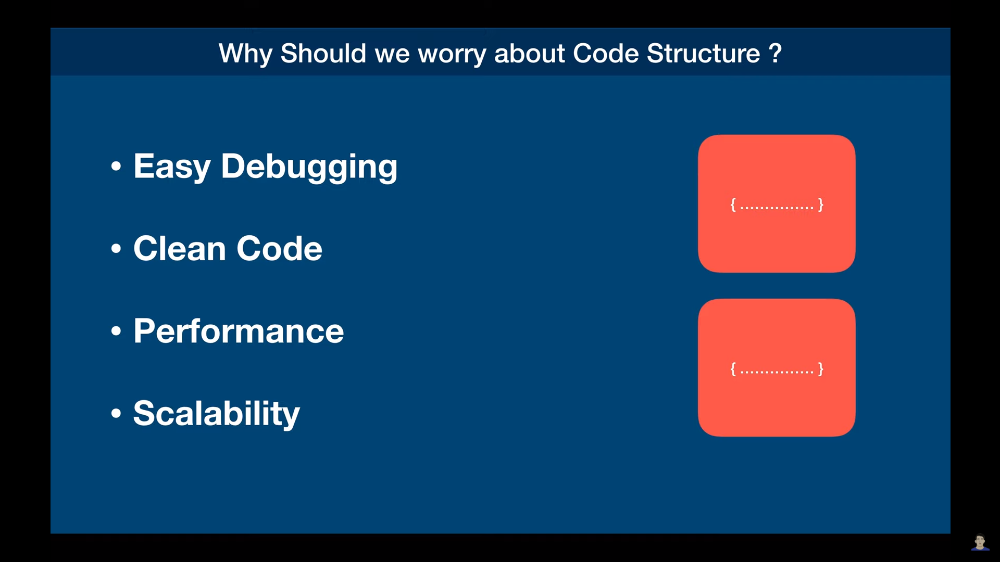
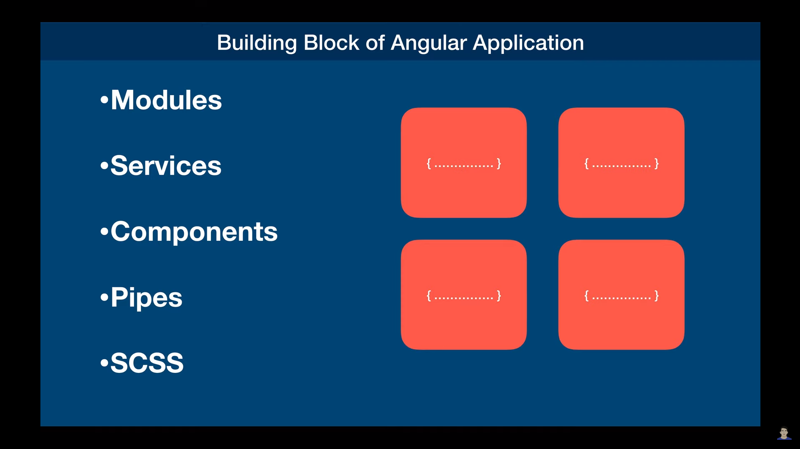
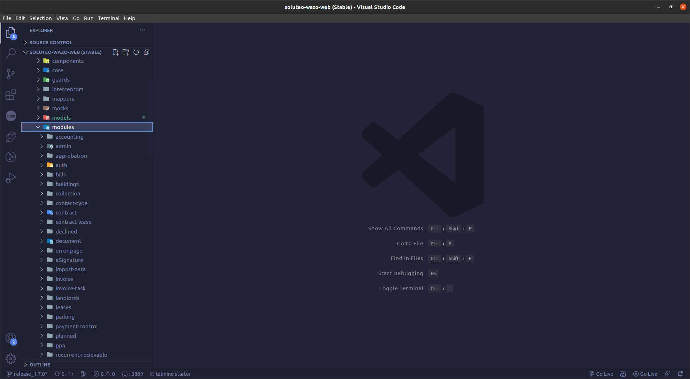
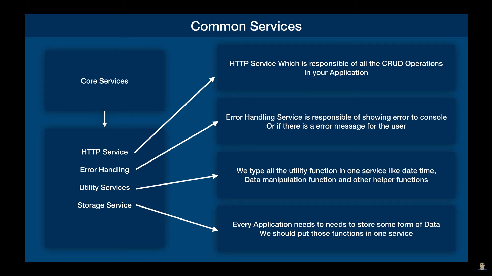
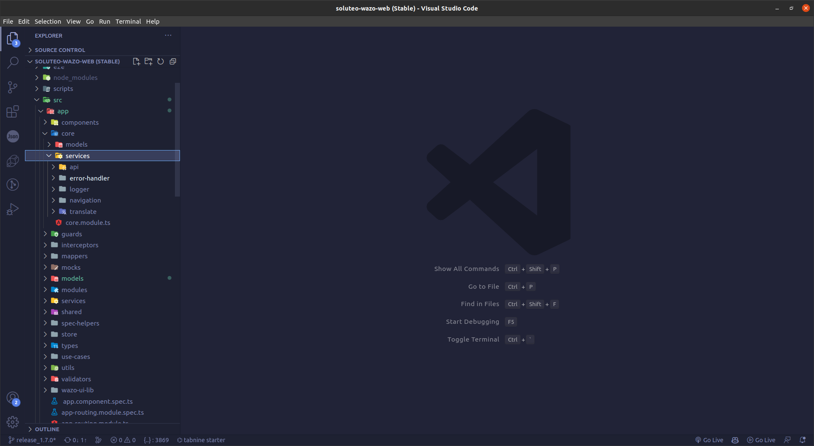
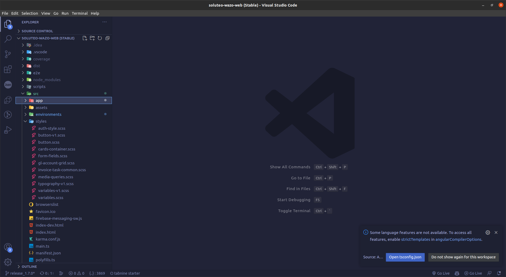
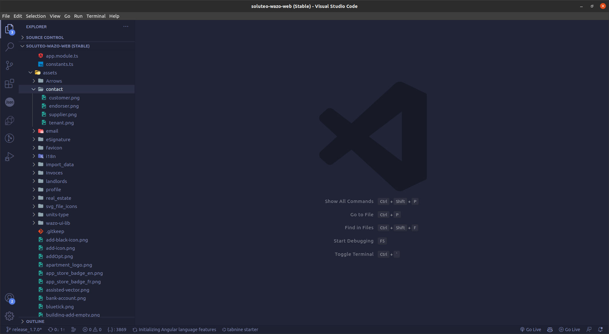

# Angular Architecture

Angular Architecture is building block of the project to ensure the application's performance, scalability.

With the help of best practices with architecture we can achieve easy debugging, error handelling, and performance etc.



### Building Blocks

Angular Application have some fundamental building blocks of the application like Modules, Services, Components,Pipes and SCSS as like mentioned below.



**Importances :-**

- **Modules :-**

    Angular applications are organized into modules which consists of related components,directives,services etc.
    With the help of modules we can reduce the application's complexity by providing way to encapsulate the similar features together which refers to same entity like `users, products etc`.

- **Services :-**

    Services are the classes which provide the shared functionality across the components. They encapsulate data manipulation, buissness logic and communication with servers.

    We should implment the methods which are getting used repetatively across the applications.

- **Components :-**

    Components are the basic building blocks of the angular applications which represents the UI elements and encapsulates their logic and behavior.

    **Types of Components :-**

    In the sclable angular architecture there should be 2 types of components which uses the terminology of `SMART` and `DUM` components as mentioned below.

    - **DUM Components :-**

        Dum Components are the components which used specifically for the representation of UI and which does not communicate with services or doesn't include the buissness logic.

        Those Takes the data from the dum components with the input properties and emits the events depending upon the requirements.

        ```
        // Template
        <div class="user" (click)="selectUser()">
            <p class="name">{{user.name}}<p/>
            <p class="age">{{user.age}}<p/>
        </div>

        // Class File
        export UserComponent{
            @Input() user:User;

            @Output() selected:EventEmitter<User> = new EventEmitter();


            public selectUser(user:User):void{
                this.selected.emit(user);
            }
        }
        ```

    - **SMART Components :-**

        SMART Components are the components which mostly include the buissness logic and communication to `store`, `services` for the external communication for data exchange.

        It Consists dum components in its templates which interchanges data and communicate with it with the help of Input properties & event emitters.

        ```
        // Template

        <app-user [user]="currentUser" (selected)="onSelection($event)"></app-user>

        // Class File
        export UsersListComponent{

            constructor(private userService: UserService){

            }

            ngOnInit():void{
                this.fetchUesr();
            }

            public fetchUser():void{
                this.userService.getCurrentUser().subscribe(user=>this.user=user)
            }
        }
        ```

- **Pipes :-**

    Pipes are the features provided by the angular that allows us to transform the data within HTML or template.

    We should group our pipes together into shared module with its directory like `shared/pipes/dataPipe.ts`.


- **Directives :-**

    Directives are the features provided by the angular that allows us to transform the structure and appearance of template.

    We should group our Directives together into shared module with its directory like `shared/directives/redEl.ts`.

- **SCSS :-**

    SCSS are the stylesheets consists of group of classes styled already to reuse them in throughout the application.

    We can group the stylesheets in `src/` directory at single place like `styles/button.scss` or `styles/colors.scss` respectively.

## Angular File structure (Best Practices)
Angular file structure mostly get divided into mostly 3-4 groups of modules as mentioned below.'

**Module Grouping :-**

- **Auth Module :-**

    This module consists of all pages regarding the authentication like login, signup, forgot password, email confirmation etc which should be seprated and easily accessible in the application as like mentioned below.

    

    This is root level module which should be initially loaded when the angular application is started.


- **Core Module :-**

    Core module would be the module which bootstraps on the top of `app.module` which consists of `singleton services, pipes, guards, components`, throughout the application by promotes the `DRY(Do not repeat yourself)` principle.

    **Common services should be in Core Modules :-**

    

    - **HTTP Service :-**

        HTTP service is one of the core services which calls the api's with the help of http module with the required params.

    - **Logging & Error Handelling :-**

        Loggin and Error Handelling service would be the service which logs the important messages and error messages to the console.

    - **Utility Service :-**

        We all use utility functions which are the functions which does not promote any perticular feature but it get used for common data formatting or manipulation should be kept in utility service.

    - **Storage Service :-**

        We all need to use the browser storage services like `LocalStorage` and `SessionStorage` for saving the JWT tokens and etc. To store, retrive, delete, modify local and sessino storage items this service should be implemented.    
    
    
- **Shared Module :-**

    Shared module is the module which consists of all pipes, directives,components which are not module specific should be kept in shared module as like mentioned below.

    

    We create our pipes, directives and frequently used in the application.


- **Feature Module :-**

    We break down the angular application into features which called as feature based architectures in which we create Seprate modules for different features.

    In the single feature there could be multiple pages like `user` feature can consists all the pages related to user like profile etc as like mentioned below.

    


    

### StyleSheets Organisation

In the app directory we create our `styles/` directory in which we group our all `scss` files together which needs to be imported in the application.

It can be created like `app/styles/buttons.scss` etc as like mentioned below.



### Assets Organisation

Angular CLI creates us an directory named as ./src/assets which should be used to keep all the ./src/assets grouped by features together like `./src/assets/user/default-user.png` as like mentioned below.



As you can see above we have grouped the icons by its category and by the feature modules.
